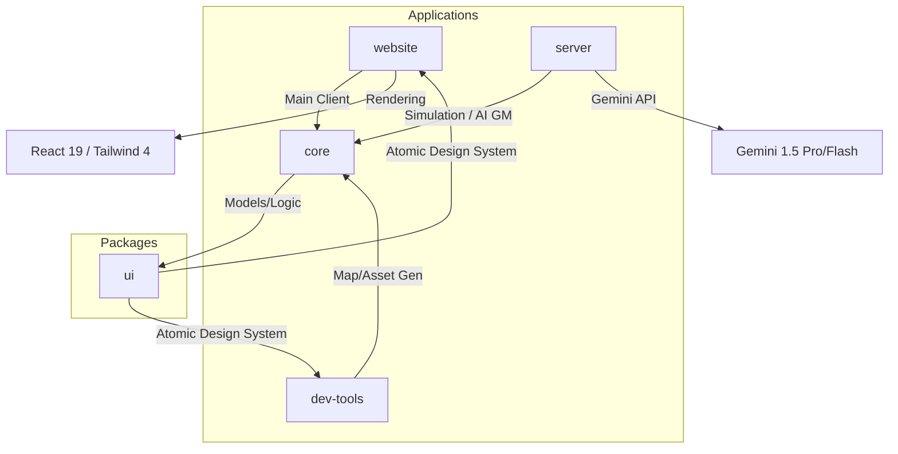

# Ashtrail

<p align="center">
  
</p>

<p align="center">
  <b>A real-time AI Game Master showcase for the <a href="https://geminiliveagentchallenge.devpost.com/">Gemini Live Agent Challenge</a>.</b><br/>
  <i>Multimodal, stateful, procedural storytelling with interleaved narrative + image synthesis.</i>
</p>

<p align="center">
  <a href="#-quickstart"></a>
  <a href="https://geminiliveagentchallenge.devpost.com/"></a>
  
  
</p>

<p align="center">
  <a href="https://bun.sh"></a>
  
  
</p>

---

## 🌌 The Concept

**Ashtrail** is a survival RPG that fuses the high-stakes survival of _Oregon Trail_ with the social tension of _Hordes/Die2Nite_, all unified by a **Gemini-powered Game Master**.

Instead of static scripts, Ashtrail uses Gemini to act as a real-time creative director. Each encounter generates interleaved outputs: atmospheric narrative text and hidden visual prompts that synthesize live scenes.

### 🎭 AI as the Director

- **Stateful Storytelling**: NPCs, factions, and quests evolve based on your crew's resources, loyalty, and past choices.
- **Multimodal Feedback**: The GM doesn't just tell; it shows. It generates visual scene descriptions that are rendered in real-time.
- **Hard Constraints**: The AI must respect the deterministic simulation (fuel, food, moral, trust). No "AI hand-waving."

---

## 🏗 Architecture

Ashtrail is built as a **Bun Monorepo** for unified type safety and rapid development.



### Modular Design

- **`apps/website`**: The player-facing portal. High-immersion survival console.
- **`apps/server`**: The "Brain." Handles the deterministic state machine and wraps the AI GM.
- **`apps/dev-tools`**: Visualization tools for map generation research and AI-driven asset spawning.
- **`packages/ui`**: A strict Design-System-first library using Tailwind CSS.
- **`packages/core`**: Shared schemas and game logic ensure consistency between client and server.

---

## ⚡ Quickstart

Ashtrail requires:

- [Bun](https://bun.sh) for the monorepo/frontend tooling
- [Rust](https://www.rust-lang.org/tools/install) (stable toolchain) for the `dev-tools` terrain backend

### 1. Installation

```bash
# Install dependencies for the entire monorepo
bun install
```

### 2. Environment Setup

Create a `.env.local` in the root (or specific app directories):

```env
GOOGLE_GENAI_API_KEY=your_gemini_api_key_here
```

### 3. Running the Apps

```bash
# Run the main game client
bun run dev:website

# Run dev-tools frontend + Rust backend together
bun run dev:dev-tools

# Run only the dev-tools Rust backend (http://127.0.0.1:8787)
bun run dev:dev-tools:backend

# Run only the dev-tools frontend (http://127.0.0.1:3000)
bun run dev:dev-tools:frontend
```

---

## 📖 Deep Dive

<details>
<summary><b>🕹 Gameplay Mechanics</b></summary>

- **Resource Scarcity**: Manage Food, Water, Fuel, Ammo, and Medicine.
- **Crew Loyalty**: Your crew are not just numbers; they have traits (greedy, loyal, paranoid) and breaking points.
- **The Rumor Economy**: Information is a tradable, decaying resource. Some rumors are life-savers; others are weaponized misinformation.
- **Nightfall Cycles**: A 24-hour strategic turn system (inspired by Die2Nite) where survival depends on group fortifications and individual AP management.
</details>

<details>
<summary><b>🛡 Factions & The World</b></summary>

The world of Olaas is controlled by dynamic, AI-driven factions:

- **The Fuel Guild**: Controllers of the most precious resource.
- **The Cult of the Static Sun**: Religious zealots with hidden agendas.
- **Scrap Nomads**: Opportunistic scavengers.
- _Factions react to player reputation, market shifts, and shared rumors._
</details>

<details>
<summary><b>🛠 Tech Stack Details</b></summary>

- **Runtime**: Bun
- **Framework**: React 19 (Vite)
- **Styling**: Tailwind CSS v4 + PostCSS
- **AI**: Gemini 1.5 Pro & Flash via `@google/genai`
- **State**: Centralized deterministic state machine in `@ashtrail/core`
</details>

---

## 🏆 Hackathon Details

Built for the **[Gemini Live Agent Challenge](https://geminiliveagentchallenge.devpost.com/)** in the **Creative Storyteller** track.

> **Challenge Focus**: We are pushing the boundaries of Gemini's multimodal capabilities by using it not just as a chatbot, but as a state-aware world engine that synchronizes narrative flow with procedural game state and visual synthesis.

---

## 📜 License

MIT © [Moebius](https://github.com/moebius)
