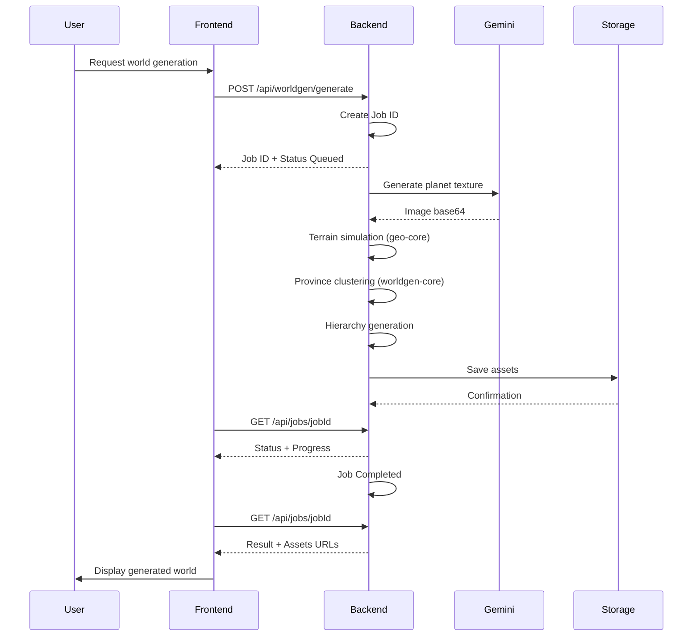
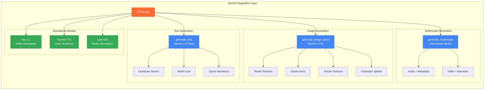
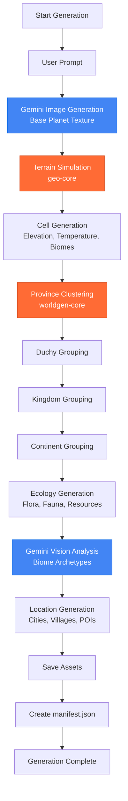
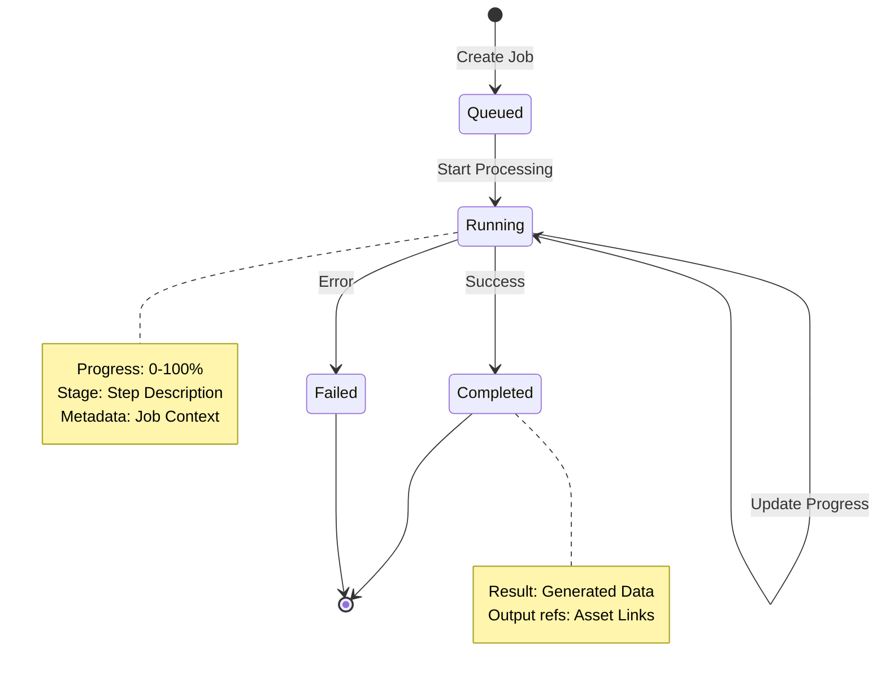
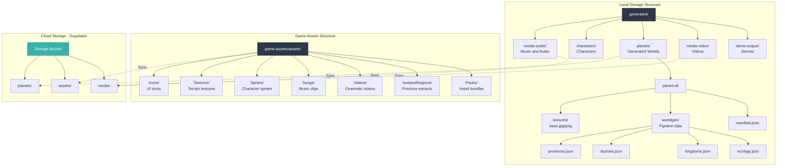
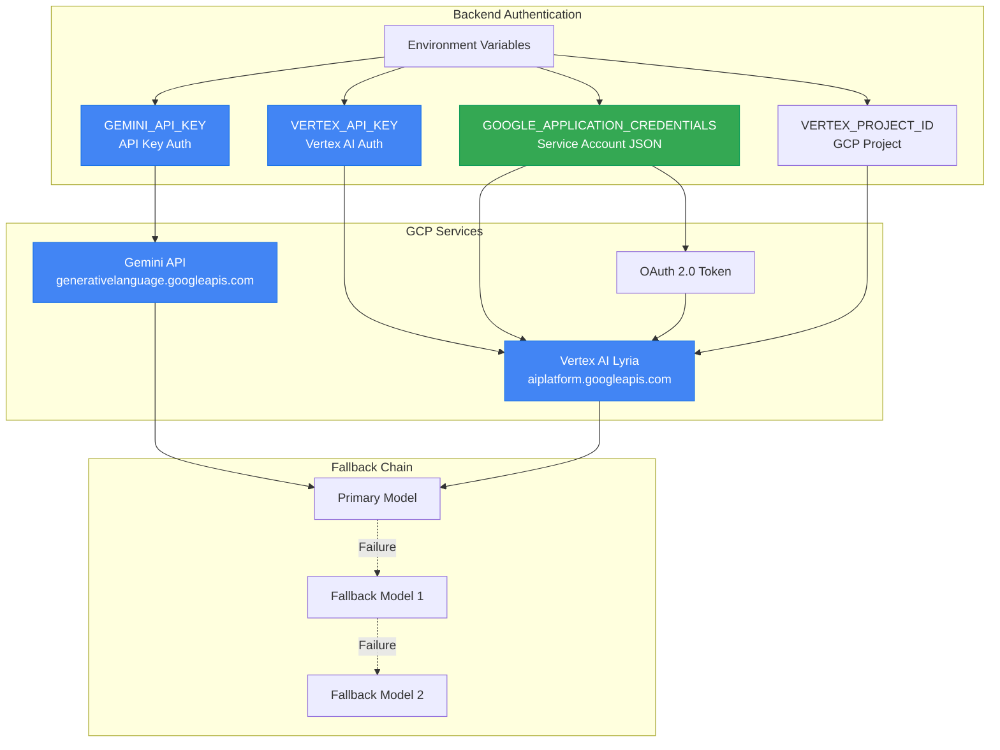

# Architecture Diagram - Ashtrail Game Development Platform

## Architecture Overview

```mermaid
graph TB
    subgraph "Frontend - React/TypeScript"
        UI[Dev Tools UI<br/>React + Vite]
        WG[World Generator]
        AG[Asset Generator]
        CB[Character Builder]
        GM[Game Master]
        QE[Quest Engine]
        EE[Ecology Editor]
        GE[Gameplay Engine]
        GAL[Gallery]
    end

    subgraph "Backend - Rust/Axum"
        API[Axum REST API<br/>Port 3001]
        WP[Worldgen Pipeline]
        GEN[Terrain Generator]
        HIER[Hierarchy System]
        JOBS[Job Queue System]
        MEDIA[Media Generation]
        CMS[Content Management]
        COMBAT[Combat Engine]
        EXPL[Exploration Engine]
    end

    subgraph "Google Cloud Platform - Gemini AI"
        GEMINI[Gemini 2.5 Flash<br/>Text Generation]
        GEMINI_IMG[Gemini 3 Pro Image<br/>Image Generation]
        GEMINI_VEO[Veo 3.1<br/>Video Generation]
        GEMINI_TTS[Gemini TTS<br/>Speech Synthesis]
        LYRIA[Lyria 002<br/>Music Generation]
    end

    subgraph "Storage & Assets"
        LOCAL[Local File System<br/>generated/]
        SUPABASE[Supabase Storage<br/>Cloud Sync]
        ASSETS[Game Assets<br/>Icons/Textures/Sprites]
    end

    subgraph "Core Libraries - Rust"
        GEO[geo-core<br/>Terrain Simulation]
        WORLDGEN[worldgen-core<br/>Province Clustering]
    end

    UI --> API
    WG --> API
    AG --> API
    CB --> API
    GM --> API
    QE --> API
    EE --> API
    GE --> API
    GAL --> API

    API --> WP
    API --> GEN
    API --> HIER
    API --> JOBS
    API --> MEDIA
    API --> CMS
    API --> COMBAT
    API --> EXPL

    WP --> GEO
    WP --> WORLDGEN
    GEN --> GEO

    MEDIA --> GEMINI
    MEDIA --> GEMINI_IMG
    MEDIA --> GEMINI_VEO
    MEDIA --> GEMINI_TTS
    MEDIA --> LYRIA

    WP --> GEMINI_IMG
    AG --> GEMINI_IMG
    CB --> GEMINI
    GM --> GEMINI
    QE --> GEMINI
    EE --> GEMINI_IMG

    API --> LOCAL
    API --> SUPABASE
    API --> ASSETS

    LOCAL -.Sync.-> SUPABASE
    SUPABASE -.Download.-> LOCAL

    style GEMINI fill:#4285f4,stroke:#1a73e8,color:#fff
    style GEMINI_IMG fill:#4285f4,stroke:#1a73e8,color:#fff
    style GEMINI_VEO fill:#4285f4,stroke:#1a73e8,color:#fff
    style GEMINI_TTS fill:#4285f4,stroke:#1a73e8,color:#fff
    style LYRIA fill:#4285f4,stroke:#1a73e8,color:#fff
    style API fill:#ff6b35,stroke:#d94e1f,color:#fff
    style UI fill:#61dafb,stroke:#21a1c4,color:#000
```

## Detailed Data Flow

## Gemini Components Architecture

## World Generation Pipeline

## Asynchronous Job System

## Storage Architecture

## GCP Integration and Authentication

## Technologies Used

### Frontend
- **React 19** - UI framework
- **TypeScript** - Type safety
- **Vite** - Build tool
- **React Router** - Navigation
- **Tailwind CSS** - Styling
- **Three.js** - 3D visualization

### Backend
- **Rust** - Performance & safety
- **Axum** - Web framework
- **Tokio** - Async runtime
- **Serde** - Serialization
- **Reqwest** - HTTP client

### GCP / Gemini
- **Gemini 2.5 Flash** - Text generation
- **Gemini 3 Pro Image** - Image generation
- **Veo 3.1** - Video generation
- **Gemini TTS** - Speech synthesis
- **Lyria 002** - Music generation

### Storage
- **Local File System** - Primary storage
- **Supabase Storage** - Cloud backup & sync

### Core Libraries
- **geo-core** - Terrain simulation (Rust)
- **worldgen-core** - Province clustering (Rust)
- **@ashtrail/core** - Shared game logic (TypeScript)

## Key Architecture Points

1. **Hybrid Architecture**: React Frontend + Rust Backend for maximum performance
2. **Complete Gemini Integration**: Text, image, video, audio, music generation
3. **Procedural Generation Pipeline**: Terrain → Provinces → Ecology → Locations
4. **Asynchronous Job System**: Long-running task management with progress tracking
5. **Hybrid Storage**: Local + Cloud with Supabase synchronization
6. **Fallback Chain**: Resilience with backup models
7. **Modularity**: Independent tools (World Gen, Asset Gen, Character Builder, etc.)
