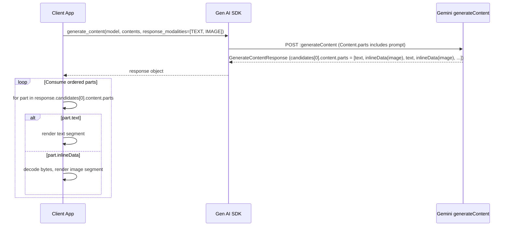
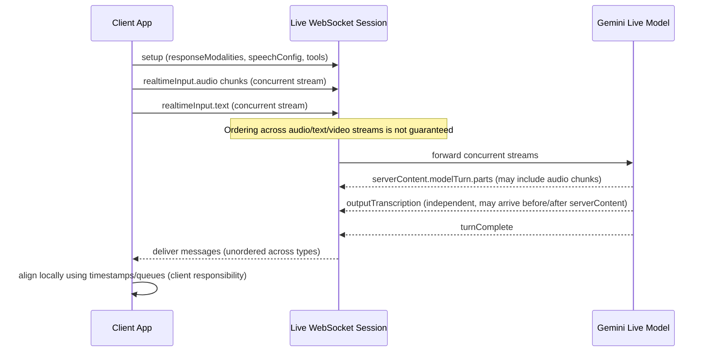

# Interleaved Multimodal Generation in the Gemini SDK Documentation

## Executive summary

In the Gemini SDK documentation, “interleaved multimodal generation” is not a vague marketing term. It is an engineering level behavior where a single model generation produces an ordered sequence of heterogeneous “parts” (for example, text parts and image byte parts) inside one model turn. You consume this output by iterating the `Content.parts[]` array and rendering each `Part` according to its concrete type (`text`, `inlineData`, `fileData`, etc.). The “interleaving” is literally the order of these parts. citeturn17view0turn1view0turn9view0

The official docs describe interleaved generation most explicitly for Gemini native image generation, where the model can output “image(s) and text (interleaved)” such as an illustrated recipe, without a second model call. This behavior is controlled by output modality configuration (`response_modalities` in Python, `responseModalities` in JavaScript, and `generationConfig.responseModalities` in REST). citeturn1view0turn9view0turn21view0turn28view0

Interleaving also appears in the realtime Live API documentation, but with a different systems meaning: audio, video, and text inputs are concurrent streams with no guaranteed ordering across streams, and even transcription messages are explicitly sent independently with no guaranteed ordering relative to main content. This is not the same as the ordered `Content.parts[]` interleaving used in `generateContent`; it is a concurrency and synchronization problem you must design for. citeturn28view0

From a performance and cost perspective, interleaved multimodal generation is still governed by token accounting. The docs state that all inputs and outputs are tokenized, including non text modalities; provide concrete tokenization rules for images, audio, and video; and provide controls such as `media_resolution` that trade quality against latency and cost by changing the token budget allocated to media processing. citeturn6view0turn33view0turn23view0turn28view0

## Technical meaning in the Gemini SDK docs

The most direct documentation level definition appears in the native image generation guide, which enumerates “Text to image(s) and text (interleaved)” and “Image(s) and text to image(s) and text (interleaved)” as supported modes. In both cases, the API returns images alongside related text in the same response. citeturn1view0

A second explicit statement appears in the Vertex AI image generation guide (using the same Google Gen AI SDK surface), under “Generate interleaved images and text.” The guide explains that supported Gemini image models can generate interleaved images with text responses, for example generating images per recipe step “without having to make separate requests to the model.” citeturn9view0

Engineering wise, the structural definition of “interleaving” is grounded in the core message schema:

- A `Content` is “the base structured datatype containing multi part content of a message” and contains an ordered `parts[]` list plus a `role` (`user` or `model`). citeturn17view0  
- A `Part` is “a datatype containing media that is part of a multi part `Content` message”, and it is a tagged union: a `Part` can contain only one of the accepted types in `Part.data` (for example `text`, `inlineData`, `fileData`, `functionCall`). citeturn17view0  
- `Blob` / `inlineData` carries raw media bytes plus an IANA MIME type, represented as base64 in JSON; unsupported MIME types return an error. citeturn17view0

Therefore, in the Gemini SDK documentation, “interleaved multimodal generation” means:

A single model response turn whose `Content.parts[]` is a typed, ordered stream containing more than one modality (most commonly text plus images), where the consumer reconstructs the multimodal artifact by processing parts in order.

The docs also note that casing differs across SDKs and examples, so “interleaving” must be interpreted at the schema level, not by assuming exact JSON field spellings in every snippet. citeturn28view0turn17view0turn32view0

## APIs, endpoints, and message formats

### Core generation endpoints and how they relate to interleaving

The Gemini API reference describes three primary ways to get model outputs:

- `generateContent`: single response after the model finishes generation. citeturn19view0turn4view1  
- `streamGenerateContent`: Server Sent Events streaming that emits multiple `GenerateContentResponse` chunks. citeturn19view0turn15search0  
- Live API `BidiGenerateContent`: stateful WebSocket session for bidirectional streaming. citeturn19view0turn28view0  

Interleaved multimodal generation in the strict “text plus image parts in one ordered parts list” sense is implemented on `generateContent` and `streamGenerateContent` for models that support multimodal output modalities such as image output. The docs show that the same request body structure is used, and multimodality is expressed by having multiple `Part` objects. citeturn19view0turn17view0turn1view0

### Table of relevant API calls

| Capability | Primary API surface | Transport | “Interleaving” semantics in docs | Best fit |
|---|---|---|---|---|
| Standard generation | `POST https://generativelanguage.googleapis.com/v1beta/{model=models/*}:generateContent` | HTTP | Interleaving is the order of `Content.parts[]` returned in `candidates[].content.parts[]`. citeturn4view1turn17view0 | Batch style or when you can wait for full response |
| Streaming generation | `POST https://generativelanguage.googleapis.com/v1beta/{model=models/*}:streamGenerateContent` | SSE | Interleaving exists within each chunk’s `candidates[].content.parts[]`; chunks share a `responseId` tying the full response together. citeturn19view0turn15search0 | Interactive UIs, progressive rendering |
| Realtime Live API | `wss://generativelanguage.googleapis.com/ws/google.ai.generativelanguage.v1beta.GenerativeService.BidiGenerateContent` | WebSocket | Audio, video, text inputs are concurrent streams with no guaranteed ordering across streams; transcription is independent and unordered relative to main content. citeturn28view0 | Realtime voice or video interaction, barge in |

### Message schema elements that matter for interleaving

The docs define the core objects you must implement against:

- `Content.parts[]`: ordered parts of a single message turn. citeturn17view0  
- `Part.data` union: a part is exactly one of `text`, `inlineData`, `fileData`, `functionCall`, `functionResponse`, `executableCode`, `codeExecutionResult`. citeturn17view0  
- `Blob` (`inlineData`): `{ mimeType, data }`, where `data` is base64 in JSON, and MIME type must be supported. citeturn17view0  
- `FileData` (`fileData`): `{ fileUri, mimeType? }`, used to reference uploaded or registered files. citeturn17view0turn32view0  
- `Part.partMetadata`: explicitly described as custom metadata that can be used, among other things, to multiplex multiple part streams or track source provenance. The docs do not specify a standard metadata schema for multimodal alignment; it is an extensibility point. citeturn17view0  

### Output modality configuration

Interleaved generation depends on (a) choosing a model that supports multimodal output, and (b) configuring response modalities when needed.

For Gemini native image generation, the image generation guide states the default output is both text and images, and you can configure to return only images by setting `response_modalities`. citeturn1view0

The docs also show explicit configuration of `response_modalities` / `responseModalities` to request both text and image outputs for interleaving. citeturn9view0turn21view0turn28view0

## Input and output modalities supported

The Gemini documentation distinguishes between:

- Multimodal input in `generateContent` (you can combine text with images, audio, video, PDFs by using multiple `Part` objects). citeturn19view0turn17view0turn32view0  
- Multimodal output, which is model dependent (most general purpose models output text; specific models can output images; TTS models output audio; Live API models can output audio or text depending on model and configuration). citeturn1view0turn7view0turn8view0turn28view0  

### Table of modalities and their documented data representations

| Modality | Input representation in `Content.parts[]` | Output representation in `Content.parts[]` | Notes relevant to interleaving |
|---|---|---|---|
| Text | `Part.text` citeturn17view0 | `Part.text` citeturn17view0turn19view0 | Primary carrier for incremental streaming in SSE and for narrative segments between images |
| Image | `Part.inlineData` with `mimeType` like `image/png` and base64 bytes, or `Part.fileData` referencing a file URI citeturn17view0turn32view0 | For image generation models, images are returned as `inlineData` parts, appearing interleaved with text parts in one response. citeturn1view0turn9view0 | Ordering in `parts[]` is the alignment mechanism; for image editing, thought signatures must be preserved citeturn18view0turn1view0 |
| Audio | In `generateContent`, audio is typically provided via `fileData` or `inlineData` depending on size; Live API realtime audio uses a `Blob` stream citeturn32view0turn28view0turn8view0 | `generateContent` TTS models output audio bytes in `inlineData` and require `responseModalities: ["AUDIO"]` citeturn7view0; Live API can deliver audio chunks as parts in a streaming server content message citeturn28view0turn8view0 | Native audio Live API models may restrict output modality to audio only, pushing text via transcription instead citeturn8view0turn28view0 |
| Video | Inline or File API via `fileData` or `inlineData`, optionally with `videoMetadata` citeturn17view0turn34search0 | Standard Gemini models primarily output text about video; interleaved video output is not specified in these docs and should be treated as unspecified for `generateContent`. citeturn34search0turn19view0 | Video processing includes sampling and tokenization rules; it affects performance and cost citeturn34search0turn33view0turn6view0 |
| Documents / PDFs | Inline bytes or File API, MIME like `application/pdf` citeturn32view0turn17view0 | Typical output is text; interleaved document output is not specified in these docs and should be treated as unspecified. citeturn32view0turn19view0 | PDF inline method has specific size limits and tokenization behavior citeturn32view0turn33view0turn6view0 |

## Streaming, timing, and synchronization across modalities

### Standard vs streaming in `generateContent`

The Gemini API reference states that `generateContent` returns a single `GenerateContentResponse` after completion, while `streamGenerateContent` returns a stream of `GenerateContentResponse` instances and uses SSE for chunk delivery. citeturn19view0turn15search0

For streaming, the reference includes an explicit mechanism for correlating chunks: “Each response contains a `responseId` that ties the full response together.” citeturn19view0

What is not specified: the docs do not define a guaranteed chunking policy for parts beyond the fact that multiple `GenerateContentResponse` objects arrive. In particular, for interleaved text plus image outputs, the docs do not specify whether image bytes can be split across multiple streaming chunks or are always delivered as whole `inlineData` parts. This should be treated as unspecified and your stream parser should be robust to either behavior.

### Thought signatures interact with streaming and interleaving

For Gemini 3 series behaviors, the Gemini 3 developer guide and the dedicated Thought Signatures guide introduce a strict requirement that affects multimodal interleaving in two ways:

- Image generation and editing: the docs state strict validation is enforced and missing thought signatures in model parts can produce 400 errors; image parts are guaranteed to include signatures in specific positions and must be returned in subsequent turns. citeturn18view0turn1view0  
- Streaming: both guides warn that a signature may arrive in a final chunk that contains an empty text part, so your stream parser must inspect parts even when the text is empty. citeturn18view0turn27view0  

This matters for “interleaved multimodal generation” because the output you interleave into your UI (text parts and image parts) can also carry hidden continuity state (the thought signature) that must be preserved for subsequent edits or tool steps. citeturn18view0turn27view0

### Live API concurrency and alignment

The Live API documentation introduces a different, explicit definition of synchronization: audio, video, and text are concurrent realtime input streams and “the ordering across these streams is not guaranteed.” It also states that if data must be interleaved between `clientContent` and `realtimeInput`, the server attempts to optimize but “there are no guarantees.” citeturn28view0

For output, the Live API reference states:

- Content is generated as quickly as possible, not necessarily in realtime, and clients may buffer playback. citeturn28view0  
- The server distinguishes `generationComplete` (model done generating) and `turnComplete` (turn completed), and notes that interruptions can remove a generation complete message, and that when the model assumes realtime playback there can be delay between generation complete and turn complete. citeturn28view0  
- Input and output transcription messages are sent independently with no guaranteed ordering, including no guaranteed ordering between `serverContent` and `outputTranscription`. citeturn28view0  

From an engineering standpoint, this means multimodal alignment in Live API must be implemented explicitly by the client if needed (for example by timestamping audio buffers locally and associating returned text transcriptions asynchronously). The docs do not provide a built in alignment key that binds audio chunks to transcription segments; that detail is unspecified.

### Mermaid sequence diagrams for data flow and synchronization





## Tokenization and encoding for non text modalities

### Encoding and MIME typing

At the wire format level, non text modalities enter and exit `Content.parts[]` through either:

- `inlineData` (`Blob`): base64 encoded bytes plus an IANA MIME type, with the explicit constraint that unsupported MIME types yield an error. citeturn17view0turn32view0  
- `fileData` (`FileData`): a URI reference to a file with optional MIME type. citeturn17view0turn32view0  

The File Input Methods guide provides engineering relevant size constraints and recommended mechanisms: inline data supports up to 100 MB per request payload (50 MB for PDFs), while File API uploads support up to 2 GB per file and are stored temporarily; URL based inputs are also supported with constraints. citeturn32view0

### Tokenization rules and modality level accounting

The token counting guide states that all input and output is tokenized, including images and non text modalities, and describes concrete tokenization heuristics:

- Images with both dimensions at most 384 px count as 258 tokens; larger images are tiled (768×768) at 258 tokens per tile. citeturn6view0  
- Video and audio are converted at fixed rates in the guide (video 263 tokens per second, audio 32 tokens per second). citeturn6view0  

The video understanding documentation refines this into an engineering oriented decomposition: per second of video, frames are sampled (default 1 FPS) and tokenized at 66 tokens per frame at low media resolution or 258 per frame otherwise; audio is 32 tokens per second; plus metadata, yielding approximately 300 tokens per second at default media resolution or 100 tokens per second at low. citeturn34search0turn33view0

The API exposes modality token counts formally:

- The `countTokens` method returns `promptTokensDetails[]` and `cacheTokensDetails[]` as lists of `ModalityTokenCount`, i.e., token counts broken down by modality for input and cached content. citeturn23view0  
- Live API server messages define `UsageMetadata.responseTokensDetails[]` as a list of modalities returned in the response, complementing `promptTokensDetails[]` for the request input. citeturn24search0turn28view0  

### Media resolution as a latency and cost control

The Media Resolution guide defines `media_resolution` as a parameter that “controls how the Gemini API processes media inputs” by setting the maximum number of tokens allocated for media inputs, allowing you to “balance response quality against latency and cost.” It supports global configuration for all multimodal models and per part configuration for Gemini 3 only (experimental). citeturn33view0

The same guide provides approximate token budgets by `media_resolution` level and media type (image, video, PDF) and explicitly frames this as a quality versus latency and cost tradeoff. citeturn33view0turn6view0

What is unspecified: the docs specify token budgets for media inputs, but do not completely specify how different internal preprocessing steps (for example pan and scan, OCR, native text extraction in PDFs) interact with all models and all input forms, beyond the approximate tables and narrative. Where you require deterministic cost bounds, you must empirically validate with `countTokens` and observed `usage_metadata`. citeturn33view0turn23view0turn6view0

## Implementation guidance, failure modes, and best practices

### Concise example: interleaved text and image generation in Python

The docs and blog examples show the pattern: set response modalities to include both text and image, then iterate parts and branch by part type. citeturn21view0turn9view0turn1view0

```python
from google import genai
from google.genai import types
from io import BytesIO
from PIL import Image

client = genai.Client()

prompt = (
    "Generate an illustrated recipe for paella. "
    "For each major step, output a short explanation and an image."
)

resp = client.models.generate_content(
    model="gemini-3.1-flash-image-preview",
    contents=prompt,
    config=types.GenerateContentConfig(
        response_modalities=["TEXT", "IMAGE"],
    ),
)

for idx, part in enumerate(resp.candidates[0].content.parts):
    if part.text:
        print(part.text)
    elif part.inline_data:
        img = Image.open(BytesIO(part.inline_data.data))
        img.save(f"step_{idx:02d}.png")
```

This is the canonical “interleaved multimodal generation” consumption loop: ordered parts, typed branching, sequential rendering. citeturn17view0turn9view0

### Concise example: interleaved text and image generation in JavaScript

The JavaScript SDK documentation shows `generateContent` and `generateContentStream`, and the Vertex AI guide shows interleaved image plus text via `responseModalities`. citeturn13view0turn9view0

```javascript
import { GoogleGenAI, Modality } from "@google/genai";

const ai = new GoogleGenAI({});

const response = await ai.models.generateContent({
  model: "gemini-3.1-flash-image-preview",
  contents: "Generate a 3 step tutorial. After each step, generate an image.",
  config: { responseModalities: [Modality.TEXT, Modality.IMAGE] },
});

for (const part of response.candidates[0].content.parts) {
  if (part.text) console.log(part.text);
  if (part.inlineData?.data && part.inlineData?.mimeType) {
    // part.inlineData.data is base64 in many JS examples; decode/load as needed.
    console.log(`Got image bytes (${part.inlineData.mimeType})`);
  }
}
```

### Streaming best practice for interleaving

For SSE streaming, the Gemini API reference makes two points that drive robust engineering:

- Streaming returns a stream of `GenerateContentResponse` objects (not one big JSON). citeturn19view0turn15search0  
- Chunks share a `responseId` to tie the response together. citeturn19view0  

For Gemini 3, both the Gemini 3 guide and Thought Signatures guide add a critical parser requirement: when streaming, signatures can arrive in a final chunk with an empty text part, so parsers must inspect all parts until completion (for example until finish reason, where available) and not stop at “no text.” citeturn18view0turn27view0

What is unspecified: how image parts arrive in streams for interleaved image plus text outputs. The docs do not specify whether image `inlineData` arrives only once, whether it can appear mid stream, or whether it can be split across chunks. Implementations should treat every chunk as potentially containing any part type and assemble output by concatenating ordered parts and merging state by `responseId`. citeturn19view0turn17view0

### Key failure modes and edge cases documented

Thought signatures and strict validation create the most important real world failure modes for interleaved multimodal workflows:

- Missing signatures in function calling steps can cause validation errors (400) in Gemini 3. The Thought Signatures guide describes strict validation rules and provides example error verbiage. citeturn27view0turn18view0  
- For parallel function calls, the docs explicitly warn that if you send back interleaved function calls and responses (FC1, FR1, FC2, FR2) instead of grouping the function responses after all calls (FC1, FC2, FR1, FR2), the API returns 400. This is an “interleaving” constraint, but it is interleaving of tool parts, not media parts. citeturn27view0  
- For image generation and editing, the Gemini 3 guide states strict validation is enforced and missing signatures in model parts leads to a 400 error; image parts have guaranteed signatures in specific positions and must be returned for conversational editing. citeturn18view0turn1view0  
- For Live API, the reference explicitly states no guaranteed ordering for concurrent modalities, and no guaranteed ordering for transcription relative to main server content, which manifests as nondeterministic ordering in client side handlers. citeturn28view0turn24search0  
- For `Blob.inlineData`, an unsupported MIME type yields an error. citeturn17view0  

### Resource and performance implications

Interleaved multimodal generation often costs more and is slower than text only generation, primarily because:

- Media inputs consume large token budgets (for example images tile into 258 token blocks; video and audio incur per second token costs). citeturn6view0turn34search0  
- Higher `media_resolution` allocates more tokens per media item, which the docs explicitly frame as increased latency and cost in exchange for better detail understanding. citeturn33view0  
- The Vertex AI image generation guide notes that generating images takes a few seconds and can be slower depending on capacity. citeturn9view0  
- File ingestion method affects bandwidth, memory pressure, and latency. Inline data can be up to 100 MB per request and is resent each time; File API uploads reduce repeated transfer but introduce preprocessing and lifecycle constraints. citeturn32view0turn34search0  

### Recommended best practices grounded in the docs

Use these practices if you want interleaved multimodal generation to be reliable rather than “works in a demo”:

Use the official SDKs unless you have a hard integration constraint. The Gemini 3 guide and Thought Signatures guide both state that official SDKs and standard chat history handling automatically manage thought signatures, which directly prevents strict validation errors in image editing and tool flows. citeturn18view0turn27view0

Treat `Content.parts[]` as your canonical presentation stream. Implement a typed renderer that consumes parts in order and is tolerant of unknown part types so new modalities (or tool related parts) do not break your pipeline. The schema defines parts as an ordered union, and `partMetadata` is an explicit extension point if you need to tag or multiplex streams. citeturn17view0

For streaming, parse to completion and inspect empty text parts. This is explicitly required to capture late arriving thought signatures in Gemini 3 streaming scenarios. citeturn18view0turn27view0

For Live API, design for concurrency and lack of ordering guarantees. Maintain separate queues for audio chunks, model turns, and transcriptions; correlate them using client side timestamps or sequence counters. The docs explicitly deny ordering guarantees and describe independent transcription delivery. citeturn28view0turn24search0

Control cost and latency with `media_resolution` and explicit token measurement. Use `countTokens` to estimate token usage by modality before sending large multimodal prompts, and validate observed `usageMetadata` in production. The docs provide modality token counts and explicitly frame `media_resolution` as a quality latency cost control. citeturn23view0turn33view0turn6view0turn24search0

Choose file input methods based on size and reuse. Inline data is best for small, transient inputs; File API is designed for large or reusable content; external URLs are for content you do not want to reupload. These tradeoffs are spelled out with size limits. citeturn32view0turn34search0

## Brief comparison with other multimodal frameworks and open questions

### Comparison at the interface level

The Gemini SDK’s interleaving model is “typed ordered parts in a single message turn,” explicitly defined via `Content.parts[]` and `Part` union types. citeturn17view0turn1view0turn9view0

This resembles the concept used in other ecosystems, but with different naming and realtime semantics:

- entity["company","OpenAI","ai company"]’s realtime API surfaces streaming events that reference the “content array” by an explicit `content_index`, and also states that audio transcription events can occur before or after response events because transcription runs asynchronously. This is conceptually similar to Gemini Live API’s “sent independently, no guaranteed ordering” transcription behavior, though implemented with different primitives. citeturn25search0turn25search13turn28view0  
- entity["company","Anthropic","ai company"]’s Messages API describes sending a structured list of messages with text and or image content to generate the next message, but the docs do not frame output as an explicitly interleaved typed parts stream in the same way Gemini image generation docs do. citeturn25search2turn17view0  

Gemini also has a unique (and operationally important) concept of thought signatures as encrypted reasoning continuity state that must be returned for strict validated workflows such as function calling and image editing; this is a different kind of “alignment” mechanism than most other APIs expose in public docs. citeturn18view0turn27view0

### Open questions and unspecified aspects in the docs

The following items are either not specified or not guaranteed by the docs and should be treated as engineering unknowns requiring empirical validation:

For `streamGenerateContent` with interleaved text plus image outputs, chunking semantics for image `inlineData` are not specified. The docs specify streaming as multiple `GenerateContentResponse` objects and show `responseId`, but do not define whether an image can be split across chunks or whether parts are always complete in one chunk. citeturn19view0turn15search0turn17view0

For interleaved text and image outputs, no explicit linkage metadata is defined that binds a specific text segment to a specific image beyond positional ordering in `Content.parts[]`. The existence of `partMetadata` is documented, but it is described as custom metadata and no standard multimodal alignment schema is specified. citeturn17view0

Output tokenization rules for generated images are not described as explicitly as input tokenization. The Live API defines `responseTokensDetails[]` by modality, but the docs do not give a simple, stable mapping from output image bytes to “image tokens” comparable to the explicit input tiling rules. Treat output token accounting for images as observable via usage metadata rather than predictable from first principles. citeturn24search0turn6view0turn33view0

In Live API, the server may “attempt to optimize for best response” when mixing `clientContent` and `realtimeInput` but “there are no guarantees.” The optimization policy and any alignment algorithm are unspecified, so applications needing deterministic alignment must enforce their own framing and sequencing. citeturn28view0

### Key official source links

```text
Gemini API reference (endpoints, request/response structure):
https://ai.google.dev/api

Content/Part/Blob schema (Part union types, inlineData, fileData, metadata):
https://ai.google.dev/api/caching

Native image generation guide (explicit “interleaved” modes, response modalities):
https://ai.google.dev/gemini-api/docs/image-generation

Vertex AI guide showing “Generate interleaved images and text” with SDK examples:
https://docs.cloud.google.com/vertex-ai/generative-ai/docs/multimodal/image-generation

Thought signatures (strict validation rules, streaming signature edge cases):
https://ai.google.dev/gemini-api/docs/thought-signatures

Gemini 3 developer guide (signature requirements, streaming signature caveat):
https://ai.google.dev/gemini-api/docs/gemini-3

Token counting guide (image tiling tokens, audio/video token rates):
https://ai.google.dev/gemini-api/docs/tokens

Media resolution guide (quality vs latency/cost control, token budgets):
https://ai.google.dev/gemini-api/docs/media-resolution

Live API WebSocket reference (concurrent streams, ordering not guaranteed, generationComplete/turnComplete, transcription ordering):
https://ai.google.dev/api/live

Live API capabilities guide (audio PCM format, sample rates, response modality limitations):
https://ai.google.dev/gemini-api/docs/live-api/capabilities

Google Developers Blog post showing interleaved text and image output and response modalities example:
https://developers.googleblog.com/experiment-with-gemini-20-flash-native-image-generation/

Gemini technical report (research context):
https://storage.googleapis.com/deepmind-media/gemini/gemini_1_report.pdf
```